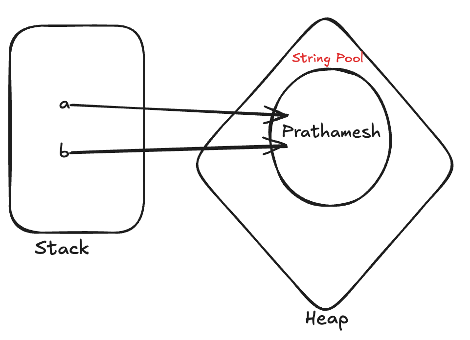

### Stack Memory and Heap Memory

```java
public class ArrayExample {
    public static void main(String[] args) {
        int arr[] = {10, 20, 30, 40, 50};
    }
}
```

In the above example, the arr variable is stored in the **stack** memory
pointing reference to **{10,20,30,40,50}** in the **heap** memory.

arr = Reference Variable = is in stack

{10,20,30,40,50} = arr is pointing to this object in the heap

### Simple String Example

```java
public class SimpleStringExample {
    public static void main(String[] args) {
        String name = "Prathamesh Borse";
        System.out.println(name);
    }
}
```


### How Strings works internally
### Simple Question
In the below example we have created two strings a and b, so now we have created two different objects, or it is pointing to the same object in java

```java
public class SimpleQuestionExample {
    public static void main(String[] args) {
        String a = "Prathamesh";
        String b = "Prathamesh";
    }
}
```


Does a and b are both pointing the sam object, or a and b variables are pointing to different objects in the heap memory

### Concepts 
1. String Pool
2. Immutability

### String Pool:
- String Pool it's a separate memory inside the heap which is useful for storing string objects
- String Pool Make our program more optimized, instead of allocating separate memory for same string objects inside the string pool,
string pool just creates one string object and points it to the variable which is using that.
- **Use case**: Making our program more optimized.



**Instead of creating 10 different variables for "Prathamesh" inside the string pool, it will create just one and point all those 10 variables reference to "Prathamesh" which is inside the String Pool**

### Immutability
- When you change the value of object, so it will do not change the other variable value because earlier they are pointing to the same object inside the heap memory.
- You cannot change the value of object because strings are immutable in java
- Once string object value is assigned it is assigned you can not change it afterwards
- Because of security reasons, they have kept the strings immutable in java

### Q. How do we check if more than one string variables are pointing to the same object or not in string pool
 

### Comparison Of Strings:
1. == ; == / is the comparator; checks for both the value and the reference variables.
eg. a = "Prathamesh"; b = "Prathamesh";
    In this case the == will give you false, but in the below case
   
    a = "Prathamesh" and b = "Prathamesh"; are pointing to the same object inside heap, so it will give you true
checks if the variable are pointing to the same object.

### How to create diff string objects of same value
```java
public class DiffObjectsSameValueExample {
    public static void main(String[] args) {
        String a = new String("Prathamesh");
        String b = new String("Prathamesh");
    }
}
```
Now the a and b objects will be created outside the string pool area, and it will create inside the heap area.

2. equals() method
    When we need to check the value we need to use .equals() method
    To check object value and do the comparison.


### String Performance (Very IMP) For Interview
```java
public class CharacterSeries {
    public static void main(String[] args) {
        String series = "";
        for (int i = 0; i < 26; i++) {
            char ch = (char) ('a' + i);
            series = series + ch;
        }
        System.out.println(series);
    }
}
```

Here what happening actually when the character is going to be add in the series so then the earlier series does not point to anything so that becomes a wastage.
To resolve this we can use something like StringBuilder because once string objects are assigned in java that are immutable means we can't change it.

### StringBuilder
- Only one object is made, and the changes are made in that object only.
- The reference is also the same and it is not changed.
- Just like we can change the array the same way we can the object value in StringBuilder
- StringBuilder is mutable means we can change the value of an object

```java
public class SBCharacterSeries {
    public static void main(String[] args) {
        StringBuilder builder = new StringBuilder("");
        for (int i = 0; i < 26; i++) {
            char ch = (char) ('a' + i);
            builder = builder.append(ch);
        }
        System.out.println(builder.toString());
    }
}
```

### String Methods
When we use any of the below methods on the string object, it will not change the original string object instead it will create a new one for you.

1. indexOf()
- In this method we need to specify the character we want to search and from which index we want to search we can give it and it will return index of based on where it is stored in character Array.

```java
import java.util.Arrays;

public class StringMethods {
    public static void main(String[] args) {
        String name = "         Prat ha me sh B or s e               ";
        System.out.println("Original String: " + name);
        System.out.println("Character Array: " + Arrays.toString(name.toCharArray()));
        System.out.println("LowerCase: " + name.toLowerCase());
        System.out.println("UpperCase: " + name.toUpperCase());
        System.out.println("Length: " + name.length());
        System.out.println("Char At: " + name.charAt(3));
        System.out.println("Print String from specific index: " + name.indexOf('r', 0));
        System.out.println("String Contains: " + name.contains("B"));
        System.out.println("Replace String: " + name.replace("Borse", "Barke"));
        System.out.println("Split String: " + Arrays.toString(name.split("")));
        // Trim = is used for to remove starting and ending whitespaces from the string
        System.out.println("Trim:" + name.trim());
    }
}
```

### StringBuilder VS StringBuffer

StringBuilder
- It is not thread safe
- All methods are not synchronized, because it is not thread safe
- Preferable to use on the single threaded environment

StringBuffer
- It is thread safe
- All methods are synchronized because of its thread safe nature
- we can use it in multithreaded environment

## Interview Tip
- If synchronization is required use **StringBuffer**; If not then use **StringBuilder** for better performance
- StringBuilder and StringBuffer creates only one object and we can modify it, because both the StringBuilder and StringBuffer classes are mutable in java
- **StringBuilder** is faster than **StringBuffer** because it avoids synchronization overhead.

### Usage Example
    
```java
public class StringBuilderExample {
    public static void main(String[] args) {
        StringBuilder sb = new StringBuilder("Hello");
        sb.append(" World");
        System.out.println(sb); // Output: Hello World
    }
}
```

```java
public class StringBufferExample {
    public static void main(String[] args) {
        StringBuffer sbf = new StringBuffer("Hello");
        sbf.append(" Java");
        System.out.println(sbf); // Output: Hello Java
    }
}
```

### Method Overloading
- Same method name, but different parameters for the method
- Which method to executes it will be decided by compiler at compile time

### Pass By Value
- Java is always Pass By Value
- Means In Java: 
- **Primitive DataTypes**: The actual value is copied
- **Object**: The reference or the memory address is copied not the full object itself copied


